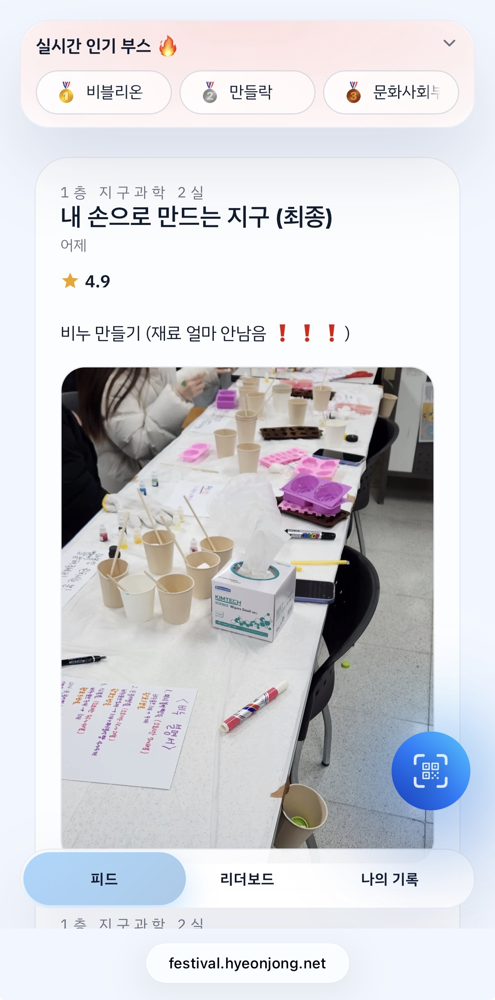
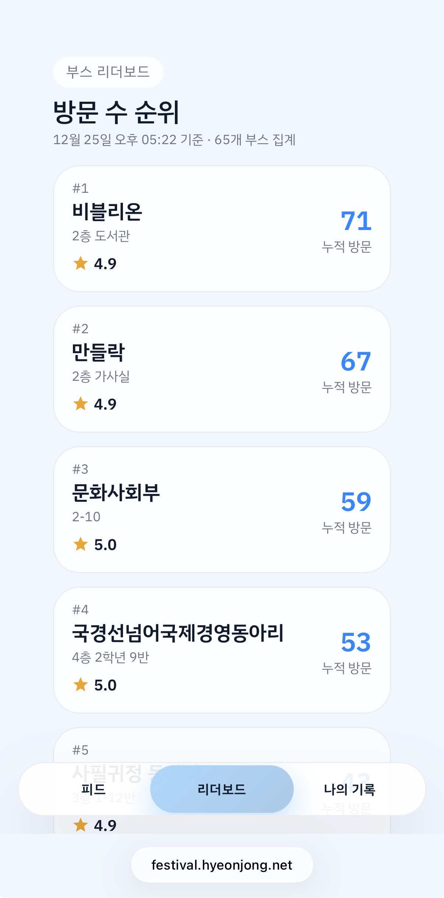

# 종촌고등학교 부스 한마당

학생, 동아리, 운영진의 부스 활동을 지원하기 위한 운영 허브입니다.

- **학생**: 로그인 → 부스 방문 → 별점/후기 → 내 기록 확인
- **부스 관리자**: 부스 QR/방문 스캔 → 실시간 방문 현황 → 피드 업로드
- **운영팀(전체 관리자)**: 계정 일괄 생성/배포 → 전체 대시보드 → 데이터 확인/내보내기

## 스크린샷

| 피드 | 리더보드 |
| --- | --- |
|  |  |

## 주요 기능

### 학생

- 5자리 코드 로그인(모바일 최적화)
- 최근 방문 기록/누적 방문 수 확인
- 부스 평점(별점) + 한줄 후기 작성, 일정 시간 내 수정 지원
- 실시간 부스 순위(리더보드) 확인

### 부스 관리자

- 내 부스 QR 토큰 발급/표출(현장 배치용)
- 카메라 기반 방문 스캔(중복 처리 정책 포함)
- 부스별 방문 현황 대시보드
- 피드 게시글 작성(텍스트 + 단일 이미지 업로드)

### 운영팀

- 학생/부스/관리자 계정 일괄 생성 + Excel 다운로드(배치 기록 보관)
- 전체 대시보드(누적 방문/고유 방문자/활성 부스/피드 수)
- DB 스프레드시트 뷰(필터/정렬) + 스냅샷 기록(운영 중 데이터 백업/공유용)

## 현장 운영 플로우

1. 운영팀이 `/admin/accounts`에서 계정을 생성하고 배포합니다.
2. 부스마다 `/booth/visits`에서 QR을 출력해 부스에 부착합니다.
3. 학생은 로그인 후, 부스에서 스캔을 통해 방문이 기록됩니다.
4. 방문 직후 학생은 별점/후기를 남기고, `/leaderboard`로 순위를 확인합니다.
5. 운영팀은 `/admin/dashboard`, `/admin/db`로 현황과 데이터를 모니터링합니다.

## 운영 결과

- 고유 방문 학생: **297명**
- 누적 방문: **477건**
- 운영 부스: **19개**
- 피드 게시글: **11건**

## 기술 스택

- Next.js + React, TypeScript
- Tailwind CSS v4
- Prisma + SQLite
